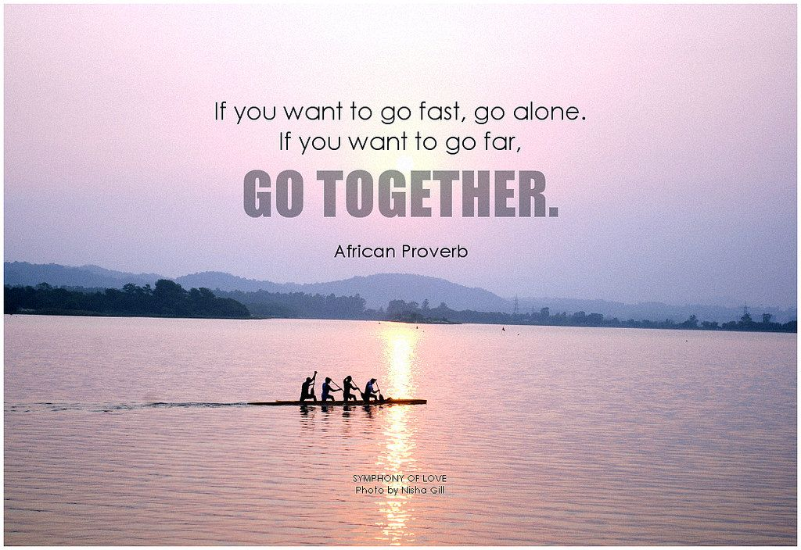

## Wanderlust

"Twenty years from now you will be more disappointed by the things that you didn't do than by the ones you did do. So throw off the bowlines. Sail away from the safe harbor. Catch the trade winds in your sails. Explore. Dream. Discover."

--H. Jackson Brown Jr.

The best time to plant a tree was twenty years ago.  
The second best time is now.

--Chinese proverb 

