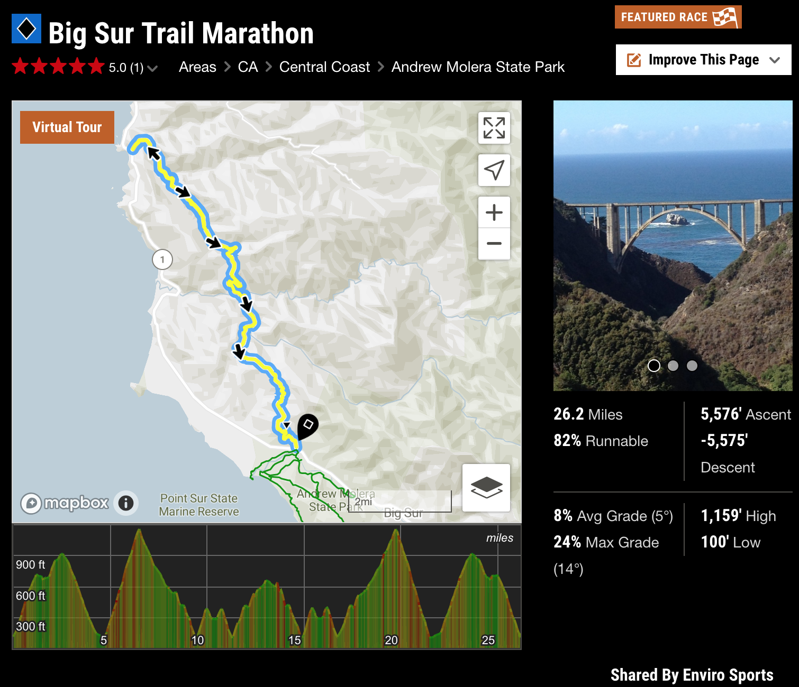

## Registered for Big Sur Trail Marathon- Sat, September 28, 2019

26.2 miles is not the scary bit. It's the 5,576' elevation change over the marathon course.

## Ultralight Backpacking

Combining alpine fly fishing, and minimalist hammock sheltering should be a fun pursuit this spring. 

Destinations will include Emmigrant Wilderness, Desolation Wilderness and Stanislaus Wilderness.

Updated some gear. Still need to buy a new fly rod.

[This was a nice primer on ultralight backpacking from REI.](https://www.rei.com/learn/expert-advice/ultralight-backpacking.html)

**map and permit** will remain on the update list.

### Outstanding aquisitions:

reel
**d-rings** 
**stormproof matches**, **mini lighter**,  
**mitts**

### Optional pack items:

**hand sanitizer**,
**reflectix at home despot 2'^2,
marking tape for trail signs,
3 mil plastic to put pack on,**

### Food Related Items

**water purification tablets**,
**madaglia doro espresso coffee in 
baggies**, 

### DIY

Make deet, 
arnica containers,
sponge,
**hummus packs
peanut butter packs
dry chili**
**pancakes**,  
**toothbrush cut in half, 
toothpaste dots or baking soda**,
**fire starter (lint, vasoline in baggie)**, 
**1" x 2" sponge**,
**paper**
**rock sack**, 
**blister pads, gauze pads**,

**sun hat, dry clean**

### Liberation

**antibiotic oitment packets, ibuprofen**,

