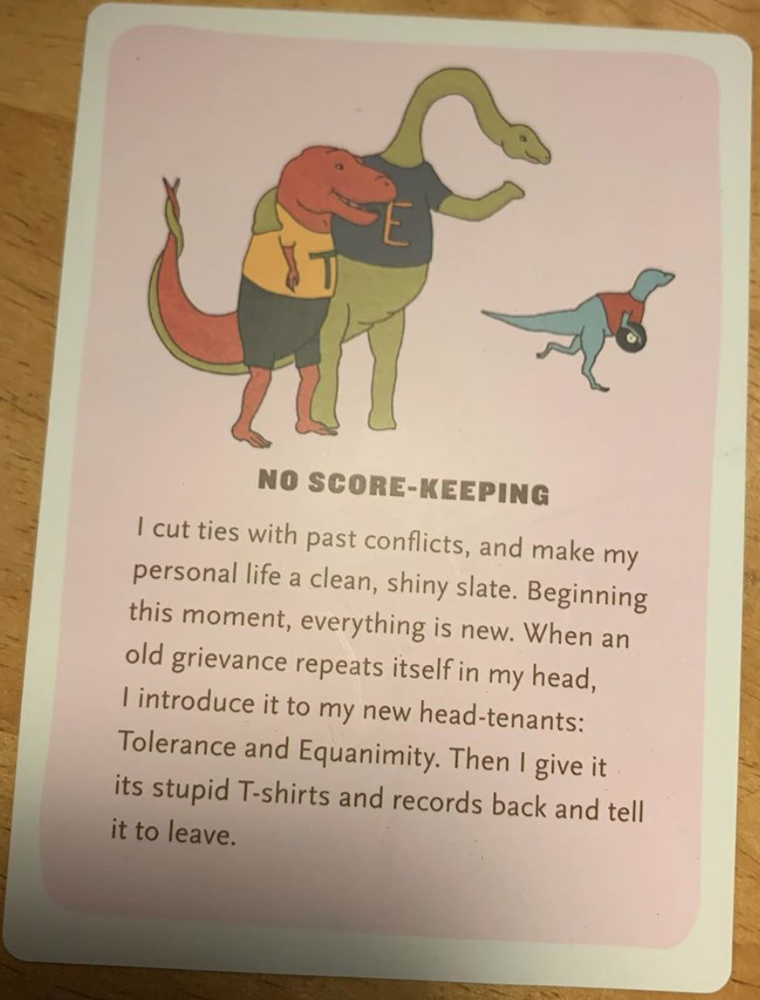

# [Dinosaurs](https://www.qwantz.com/)

## No Score-Keeping

### 2020 January 4

"I cut ties with past conflicts, and make my personal life a clean, shiny slate. Beginning this moment, everything is new. When an old grievance repeats itself in my head, I introduce it to my new head-tenants: Tolerance and Equanimity. Then I give it its stupid T-shirts and records back and tell it to leave."

[Grievance](https://www.google.com/search?safe=active&sxsrf=ACYBGNS9458BKfSA0X--RY2MfvHaqeujBA%3A1578152011030&ei=S7AQXtG7AZDr-wSt5auIDg&q=Grievance&oq=Grievance&gs_l=psy-ab.3..0l10.65533.67213..67342...0.1..0.90.681.9......0....1..gws-wiz.......0i71j35i39j0i131j0i67j0i273.GAHxpL6jKhA&ved=0ahUKEwiRjZOwourmAhWQ9Z4KHa3yCuEQ4dUDCAs&uact=5)- a real or imagined wrong or other cause for complaint or protest, especially unfair treatment.

[Tolerance](https://www.google.com/search?q=tolerance&oq=Tolerance&aqs=chrome.0.0l8.2799j1j7&sourceid=chrome&ie=UTF-8)- the ability or willingness to tolerate something, in particular the existence of opinions or behavior that one does not necessarily agree with. 

[Equanimity](https://www.google.com/search?safe=active&sxsrf=ACYBGNQNA-r4ACGDY8mPnsMtGsW_5C7OLw%3A1578151933057&ei=_a8QXvCDA87_-gSihaKwDQ&q=Equanimity&oq=Equanimity&gs_l=psy-ab.3..0i273i70i249j0l9.76201.76201..77048...0.3..0.82.82.1......0....2j1..gws-wiz.......0i71.QaOUW70qy5k&ved=0ahUKEwiw9vuKourmAhXOv54KHaKCCNYQ4dUDCAs&uact=5)- mental calmness, composure, and evenness of temper, especially in a difficult situation.

